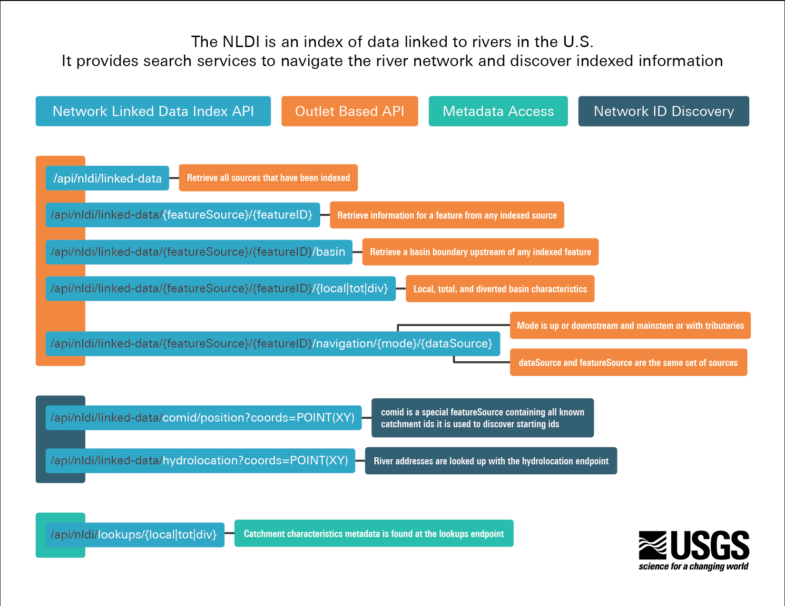

NLDI API Documentation
**********************

This package implements an API service using Flask to provide access to the
NLDI data and services.  The documentation here describes implementation
details of the API and how you might extend it to provide additional services.

We implement coverage of these endpoints
(Image from https://labs.waterdata.usgs.gov/docs/nldi/about-nldi/index.html):

.. toctree::
    :hidden:

    Overview
    API
    Plugins
    Glossary
    About
